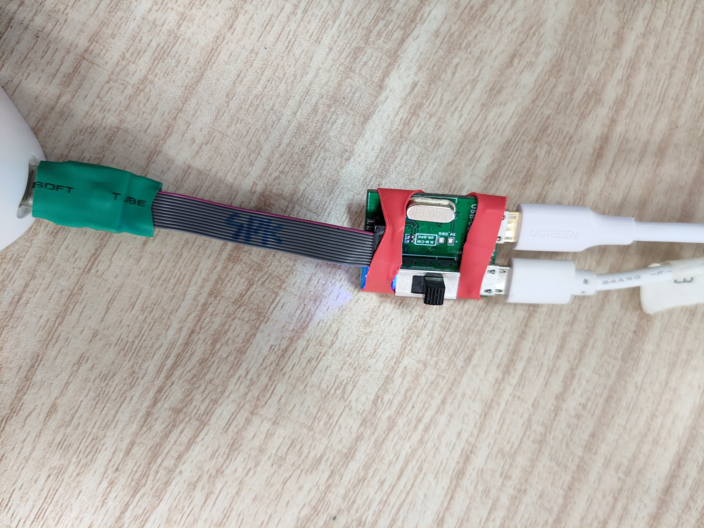

# 3R-chatGPT

Based on the [whisper.cpp](https://github.com/ggerganov/whisper.cpp) project, we created a new example called r3_talk, which integrates the OpenAI API and the open-source TTS project [piper](https://github.com/rhasspy/piper). The project runs on our self-designed [Linux speaker](音箱购买链接), with the firmware burned being the Armbian system.

## Firmware

First, you need to prepare a firmware for flashing. You can either download the pre-compiled firmware we provide or compile a new one by yourself. [Armbian_for_speaker_5.10.142](https://dl.3reality.co/release/Mycroft/mycroft_for_speaker_jammy_current_5.10.142.burn.img)

Before compiling the Armbian firmware, you need to prepare a Linux environment system. Then follow the steps below:

1. Download code

```bash
git clone https://github.com/armbian/build.git
cd Armbian

# Currently, higher versions of Kernel may experience startup exceptions
git checkout 31ac6383e1ac7e
```

Download the `patch` below and place it in the directory of `patch/kernel/archive/meson64-5.10/`

[thirdreality-0001-arm64-dts-meson-axg-add-sound-support-for-JetHub-D1.patch](release链接)

2. Ensure to use Kernel version 5.10.xx

Modify file: Armbian/config/sources/families/include/meson_common.inc

```java
current)
KERNELBRANCH='branch:linux-5.10.y'
KERNELPATCHDIR='meson64-current'
;;
```

3. Compile

```bash
./compile.sh BOARD=jethubj100 BRANCH=current RELEASE=jammy BUILD_MINIMAL=no BUILD_DESKTOP=no KERNEL_ONLY=no KERNEL_CONFIGURE=no COMPRESS_OUTPUTIMAGE=sha,gpg,img
```

4. Generate firmware

Unzip the compression file `convert.zip` in Linux.
Place `u-boot.bin` and `Armbian_22.11.0-trunk_Jethubj100_jammy_current_5.10.152.img` generated in Armbian into the `convert` directory.
Modify the corresponding firmware name in `build.sh`.
```bash
./build.sh
```

## Burn

Download and extract [Aml_Burn_Tool.zip](release链接). If it is your first time using, you need to click on Setup_Aml_Burn_Tool_V3.1.0.exe to install some drivers. Then run Aml_Burn_Tool.exe in the v3 folder. Load the compiled **.img firmware and click Start Burn.

You need to remove the bottom cover of the speaker, short-circuit the two terminals shown in the picture below, and then power on the speaker to start the burning process.


You may also need to purchase a [debugging board](购买链接), which can not only help you burn the program more conveniently but also enable you to input commands to the speaker through the serial port.



When burning the firmware using the debugging board, you need to prepare two Android data cables to connect the debugging board to the computer. Short-circuit the contacts in the diagram, and then toggle the switch on the debugging board. If the blue light is on, it indicates that it has been powered on, and wait for the burning process to begin.

After the burning process is successful, you can restart the speaker and perform the initial configuration of the armbian system through the serial port. One thing to note is that there will be two serial ports displayed on the computer. Please open the one with the higher number and change the baud rate to 115200.


## Config

The example `r3_talk` example depends on some libraries. You can config it:

```bash
# Download code
git clone https://github.com/thirdreality/3R-chatGPT.git

# Open the project root directory, run r3_config.sh
cd 3R-chatGPT
./r3_config.sh

# if "Permission denied", run
chmod +x r3_config.sh
```

The `config.sh` script includes some dependency installations and configuration of the gpio for the speaker. You can refer to the content and install and configure according to your own needs. The GPIO configuration includes enabling the sound and RGB. We write it into `/etc/profile.d/r3_gpio.sh` to ensure that the script is automatically executed every time you log in.


## OPENAI_API_KEY

To run chatGPT, you need to set your OPENAI_API_KEY environment variable:

```bash
# Open /etc/profile
vim /etc/profile

# Add OPENAI_API_KEY
export OPENAI_API_KEY="your-openai-key"

# Make variables effective
source /etc/profile
```


## Piper(TTS)

Before building, You must copy the dependency lib of Piper to the desired path:

```bash
# Open the project root directory, run
cp -r piper/lib/lib*  /usr/lib/aarch64-linux-gnu
cp -r piper/lib/espeak-ng-data/  /usr/share
```


## Building

You can build it like this:

```bash
# Build the "r3_talk" executable
make r3_talk
# Encoder processing can be accelerated on the CPU via OpenBLAS.
WHISPER_OPENBLAS=1 make r3_talk

# Run it
./r3_talk -m ./models/ggml-tiny.en.bin -ac 512 -t 4 -c 0 -pm ./piper/models/en-us-amy-low.onnx 
```


## Help

```java
$ ./r3_talk -h

usage: ./r3_talk [options]

whisper options:
  -h,       --help          [default] show this help message and exit
  -t N,     --threads N     [4      ] number of threads to use during computation
  -pms N,   --prompt-ms N   [5000   ] prompt duration in milliseconds
  -vms N,   --voice-ms N    [8000   ] voice duration in milliseconds
  -c ID,    --capture ID    [-1     ] capture device ID
  -mt N,    --max-tokens N  [32     ] maximum number of tokens per audio chunk
  -ac N,    --audio-ctx N   [0      ] audio context size (0 - all)
  -vth N,   --vad-thold N   [0.60   ] voice activity detection threshold
  -fth N,   --freq-thold N  [100.00 ] high-pass frequency cutoff
  -su,      --speed-up      [false  ] speed up audio by x2 (reduced accuracy)
  -tr,      --translate     [false  ] translate from source language to english
  -ps,      --print-special [false  ] print special tokens
  -pe,      --print-energy  [false  ] print sound energy (for debugging)
  -l LANG,  --language LANG [en     ] spoken language
  -m FILE,  --model-whisper [models/ggml-base.en.bin] whisper model file
  -ld FILE, --light led     [./examples/r3_talk/light] command for light
  -f FNAME, --file FNAME    [       ] text output file name
  -pw LANG, --prompt LANG   [hi thirdreality] prompt word


usage: ./r3_talk [options]

piper options:
  -h,       --help               show this message and exit
  -pm FILE  --piper-model        FILE  path to onnx model file
  -pc FILE  --config             FILE  path to model config file (default: model path + .json)
  -sid NUM  --speakerid   NUM    id of speaker (default: 0)
  --noise_scale           NUM    generator noise (default: 0.667)
  --length_scale          NUM    phoneme length (default: 1.0)
  --noise_w               NUM    phoneme width noise (default: 0.8)
  --silence_seconds       NUM    seconds of silence after each sentence (default: 0.2)
  --espeak_data           DIR    path to espeak-ng data directory
  --tashkeel_model        FILE   path to libtashkeel onnx model (arabic)
  --volume                NUM    volume value of the output audio (1-100)

```


## Dependence

This project is based on the whisper.cpp project and integrated with the Piper project. For more details, please refer to:

### [whisper.cpp](https://github.com/ggerganov/whisper.cpp)
High-performance inference of [OpenAI's Whisper](https://github.com/openai/whisper) automatic speech recognition (ASR) model.

### [piper](https://github.com/rhasspy/piper)
A fast, local neural text to speech system that sounds great and is optimized for the Raspberry Pi 4.
Piper is used in a variety of projects.


