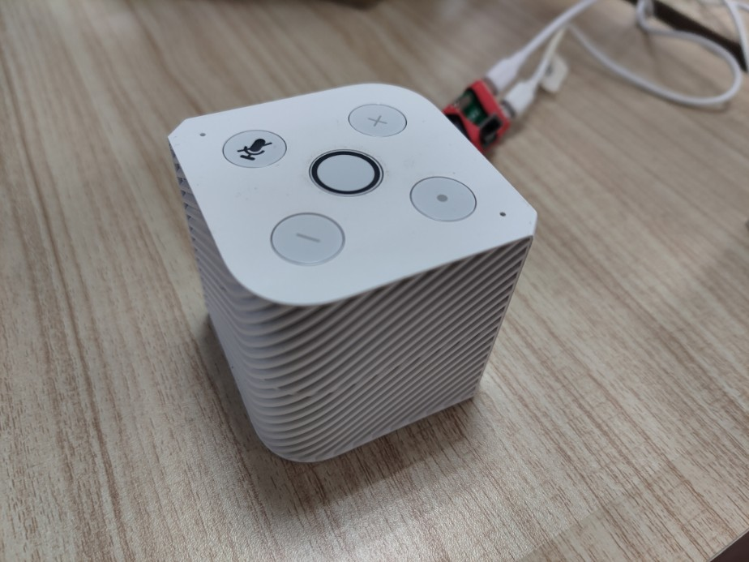
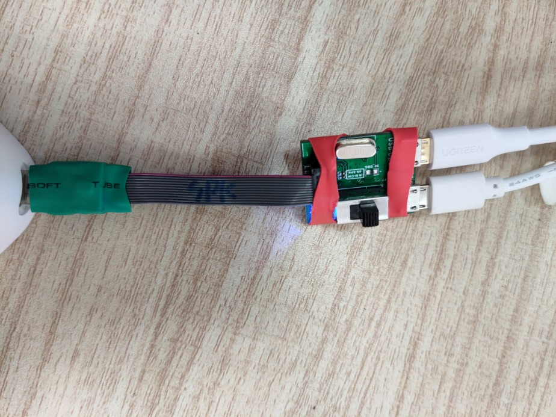
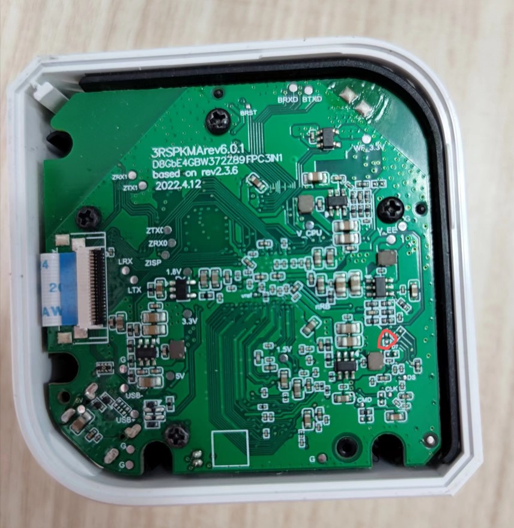
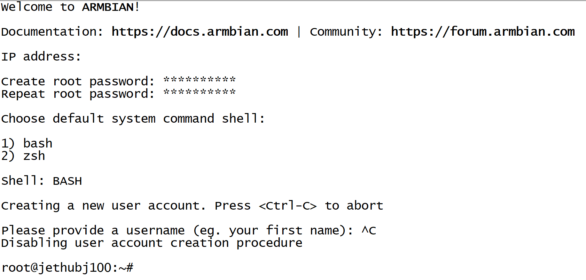
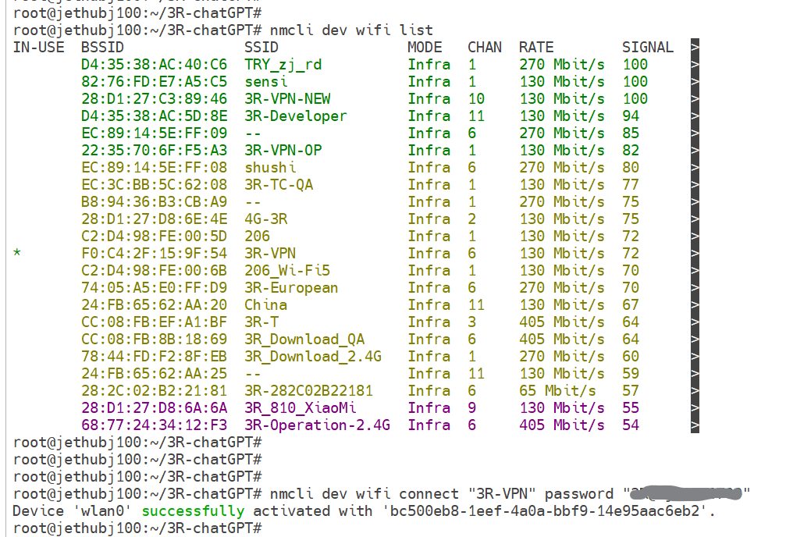

# Hardware

The project operates on our custom `Linux speaker`, running the Armbian system as its firmware. Additionally, we utilize our self-developed `debug board` that not only facilitates program burning but also enables command input to the speaker via the serial port.
* [Linux speaker](https://www.3reality.com/online-store/Smart-Speaker-DEV-Kit-p572273110)

<a href="/images/speaker.jpg"></a>

* [debug board](https://www.3reality.com/online-store/Smart-Speaker-DEV-Kit-p572273110)

<a href="/images/debug_board.jpg"></a>

* two Android data cables


Please prepare two Android data cables - one for retrieving serial port data and another one for powering. When connecting to the computer, note that there will be two serial ports displayed. Open the one with the higher number and change the baud rate to 115200. After that, you can proceed to [initialize and configure](#Initialize) the Armbian system.

***Ensure that the USB Type-C interface of the debug board is correctly connected to the speaker as shown in the following figure.*** If it is inserted in reverse, no log information will be displayed through the serial port.

<a href="/images/debug_speaker.jpg"></a>

## Firmware

If you want to reflash the armbian firmware, you can either download the pre-compiled firmware we provide or compile a new one by yourself. 

### 1. Download a pre-compiled firmware
[Armbian_for_speaker_5.10.142](https://dl.3reality.co/release/Mycroft/mycroft_for_speaker_jammy_current_5.10.142.burn.img)

Download the firmware above, then [burn](#Burn) it.

### 2. Compile a new firmware
Before compiling the Armbian firmware, you need to prepare a `Linux` environment system. Then follow the steps below:

2.1. Download code

```bash
git clone https://github.com/armbian/build.git
cd build

# Currently, higher versions of Kernel may experience startup exceptions
git checkout 31ac6383e1ac7e
```

Download the `patch` below and place it in the directory of `patch/kernel/archive/meson64-5.10/`

[thirdreality-0001-arm64-dts-meson-axg-add-sound-support-for-JetHub-D1.patch](https://github.com/thirdreality/3R-chatGPT/releases/download/Assets/thirdreality-0001-arm64-dts-meson-axg-add-sound-support-for-JetHub-D1.patch)

2.2. Ensure to use Kernel version 5.10.xx

Modify file: Armbian/config/sources/families/include/meson_common.inc

```java
current)
KERNELBRANCH='branch:linux-5.10.y'
KERNELPATCHDIR='meson64-current'
;;
```

2.3. Compile

Run in the root directory of build.

```bash
./compile.sh BOARD=jethubj100 BRANCH=current RELEASE=jammy BUILD_MINIMAL=no BUILD_DESKTOP=no KERNEL_ONLY=no KERNEL_CONFIGURE=no COMPRESS_OUTPUTIMAGE=sha,gpg,img
```

The compiled generated firmware is located:

`output/images/Armbian_22.11.0-trunk_Jethubj100_jammy_current_5.10.166.img`

(This firmware is not yet available for burning.)

2.4. Generate firmware

Unzip `Armbian_convert.zip` 

[Armbian_Convert.zip](https://github.com/thirdreality/HA-Box/releases/download/Assets/Armbian_Convert.zip)

Copy `Armbian_22.11.0-trunk_Jethubj100_jammy_current_5.10.166.img` to `Armbian_Convert`.

```bash
cp build/output/images/Armbian_22.11.0-trunk_Jethubj100_jammy_current_5.10.166.img Armbian_Convert/
```

(If the compiled firmware is not `xxx.166.img`, you need to change to the appropriate name in `Armbian_Convert/build.sh`.)

Add executable permissions to first, then run `./build.sh`.

```bash
cd Armbian_Convert
chmod +x *
chmod +x tools/*
./build.sh
```

The generated firmware is located:

`Armbian_Convert/output/Armbian_22.11.0-trunk_Jethubj100_jammy_current_5.10.166.burn.img` 

## Burn

To prepare the burning environment on the computer:
1. Download and extract the file [Aml_Burn_Tool.zip](https://github.com/thirdreality/3R-chatGPT/releases/download/Assets/Aml_Burn_Tool.zip).
2. If this is your first time using the tool, click on `Setup_Aml_Burn_Tool_V3.1.0.exe` to install necessary drivers.
3. Next, navigate to the `v3` folder and run `Aml_Burn_Tool.exe`.
4. Load the compiled `**.img` firmware file.
5. Click on `Start` to initiate the burn process.

<a href="/images/bottom.jpg"></a>

To initiate the burning process for the speaker using the debug board:
1. Make sure both Android data cables are connected to the computer.
2. Remove the bottom cover of the speaker.
3. Locate and short-circuit the two terminals as shown in the picture above. **To ensure optimal results, it is advisable to use a tweezer when briefly connecting the two terminals. Given the terminals' small dimensions and vulnerability to damage, it is not advisable to attach two wires to them.**
4. Power on the speaker by toggling the switch on the debugging board, with the blue light indicating activation.
5. Once the computer indicates that the burning process has begun, you can safely release the tweezer without the need to constantly short-circuit the two terminals. Then wait for the burning process to complete successfully.

After the burning process is successful, restart the speaker and perform the initial configuration of the armbian system through the serial port.

## Initialize

When a burned speaker is turned on for the first time, it usually requires some configuration.

### 1. Enter root user

* Create and verify root password: must be a minimum of 8 characters and should not be overly simplistic
* Choose default system command shell: choose 1
* Press `Ctrl-C` to abort

<a href="/images/initialize.png"></a>

### 2. WiFi configuration

After entering the root user, you can configure the network using the following commands.

```bash
# Scan WiFi networks, ctrl-c quit
nmcli dev wifi list
# Connect "network-ssid"
nmcli dev wifi connect "network-ssid" password "network-password"
```

<a href="/images/wificonfig.png"></a>

